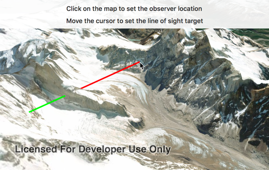

# Line of sight (location)

This sample demonstrates how to interactively place a line of sight between two locations.

## How it works

`AGSLocationLineOfSight` analysis provides an initializer called `init(observerLocation:targetLocation:)` that takes observer and target locations.

Once the `AGSLocationLineOfSight` is created, it is added to a collection of analysis overlays in the `AGSSceneView`. The analysis overlays are used to render the results of visual analysis on the scene view.

The sample uses the `geoView(_:didTapAtScreenPoint:mapPoint:)` method on `AGSGeoViewTouchDelegate` to get the clicked point on the scene view and sets the `observerLocation` on the `AGSLocationLineOfSight`. To set and move the `targetLocation`, use a long click and drag gesture. The `targetLocation` is set on `geoView(_:didLongPressAtScreenPoint:mapPoint:)` and is updated on `geoView(_:didMoveLongPressAtScreenPoint:mapPoint:)`.

As a result of the analysis, a line is rendered between the observer and target with distinct colors representing visible and obstructed segments. The sample shows visible segment in green and obstructed segment in red.
