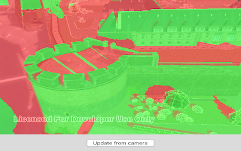

# Viewshed (Camera)

This sample demonstrates how to create a location viewshed from a camera.

## How it works

The sample starts with a viewshed created from the initial camera location (observer) and minimum distance (in meters) and maximum distance (in meters) from the observer at which visibility will be evaluated. The viewshed analysis object is created using the initializer of the `AGSLocationViewshed` called `init(camera:minDistance:maxDistance)`.

The output is displayed in an overlay representing the visible areas in green color and non-visible areas in red color. This is achieved by first creating an `AGSAnalysisOverlay` for the viewshed and adding that overlay to a collection of analysis overlays in  `AGSSceneView`.

When user clicks the button called `Update from camera`, the viewshed is updated with the current camera by calling the `update(from:)` method on `AGSLocationViewshed`.
