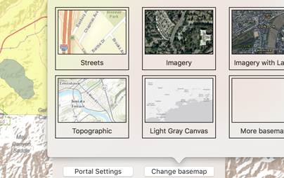

# Show organization basemaps

This sample demonstrates how to load a portal and then use the organization's predefined basemaps query to get all basemaps.

## How to use the sample

The sample comes with a feature layer and a basemap already added to the map. Click on the `Settings` button in the bottom toolbar to specify the URL to your organization’s portal. And if you want to login or not. Click on `Done` to save the settings. Now click on the `Change basemap` button to get the list of basemaps from the portal. By default, only 5 basemaps are listed. If more are available, you can click on the `More basemaps` cell to download. You can click to select a basemap and replace the existing the basemap in the map.

## How it works

The sample initializes an `AGSPortal` object with the portal URL provided in the settings view, with `loginRequired` set based on the `Anonymous` flag. The initializer used is `AGSPortal(url:loginRequired:)`. To get the basemaps from the portal, the `basemapGalleryGroupQuery` on the `portalInfo` is used to create `AGSPortalQueryParameters` object. The parameters object is then used to `findGroups(with:)` in the portal. The `groupID` of the resulting group is then passed as parameters to the `findItems(with:)` method to get portal items in that group. When a selection is made in the list, an `AGSBasemap` object is created from the selected portal item using the `AGSBasemap(item:)` initializer.

