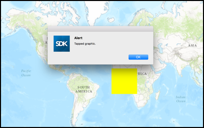

# Identify graphics

This sample demonstrates how to identify graphics in a graphics overlay.

## How to use the sample

When you tap on a graphic on the map, you should see an alert view.

## How it works

The sample implements the `geoView(_:didTapAtScreenPoint:mapPoint:)` delegate method on `AGSGeoViewTouchDelegate` to determine when a user tapped on the map. The method provides a property `mapPoint` which specifies the corresponding point in the map. The app then uses the `identify(_:screenPoint:tolerance:returnPopupsOnly:completion:)` method on `AGSMapView` to identify graphics at that particular location.

