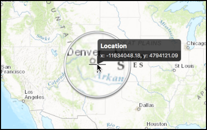

#Show callout

This sample demonstrates how to show location coordinates on a map using a callout.

##How to use the sample

Tap on the map to get the coordinates for the location in a callout. Tap again to hide it.

##How it works

When the user taps on the map view the `mapView:didLongPressAtScreenPoint:screenPoint:mapPoint` method on the `AGSMapViewTouchDelegate` is fired. Inside this method we setup the `callout` object on the `mapView`, by setting the `title` property as "Location" and `detail` property as a string composed using `mapPoint`. Then the `showCallout` method is called.

