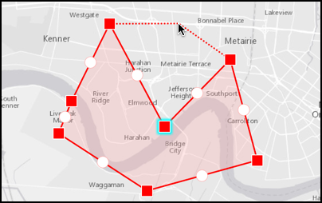

#Sketch on the map

This sample demonstrates how you can use the sketch editor to draw point or line or polygon geometry

##How to use the sample

The sample has a toolbar of sketch tools at the bottom. You can choose the type of geometry using the switch. Sketch by clicking on the map. There are tools to undo or redo an action or clear everything.

##How it works

To set the type of geometry, you need to use the `start(with:creationMode:)` method on `AGSSketchEditor`. It could be of mode `.point` or `.polyline` or `.polygon`. The sketch editor has a undo manager of type `UndoManager` that provides the undo and redo methods. To clear everything there is a `clearGeometry` method on the sketch editor.

