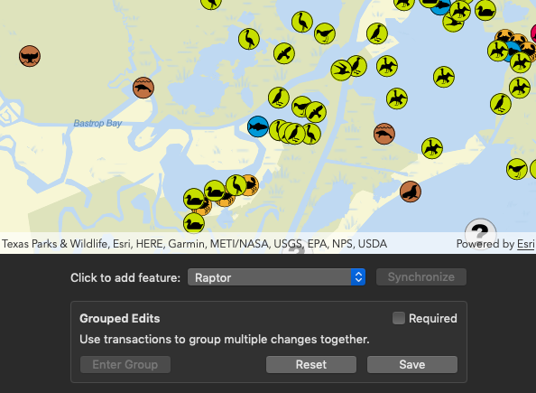

# Use geodatabase transactions

This sample demonstrates how to download a geodatabase from a feature service, add features with or without transactions, and sync the geodatabase back to the service.

## How to use the sample

1. Upon opening, the sample automatically downloads the geodatabase from the feature service. A progress bar indicates the status.
2. Once downloaded, an area of the [SaveTheBay dataset](https://sampleserver6.arcgisonline.com/arcgis/rest/services/Sync/SaveTheBaySync/FeatureServer) is shown in the map view.
3. Click the Enter Group button to start a geodatabase transaction.
4. Click on the map to add features.
5. Use the popup button to select what type of feature is added when clicking.
6. Click Reset to rollback your changes or Save to commit them. Both of these options end the transaction.
7. Uncheck the Required box to allow changes outside transactions.
8. Click Synchronize to upload your added features to the feature service. The remote data is reset daily.

## How it works

These steps focus on the tasks specific to this sample. Please see other samples for discussion on API not covered here.

#### Creating the local geodatabase from the feature service

1. In `viewDidLoad()`, a `AGSGeodatabaseSyncTask` object is created using the URL of a feature server that allows read/write synchroniztion.
2. `defaultGenerateGeodatabaseParameters(withExtent:completion:)` is called on the `AGSGeodatabaseSyncTask` object to retrieve the parameters suitable for downloading the geodatabase. The same `AGSEnvelope` object used to set the viewpoint of the map view is passed in as the extent.
3. The parameters are configured to include only the required data by filtering the `layerOptions` and setting `returnAttachments`.
4. `generateJob(with:downloadFileURL:)` is called on the `AGSGeodatabaseSyncTask` object, passing in the configured parameters and the local URL for the geodatabase. This returns a `AGSGenerateGeodatabaseJob` object.
5. `start(statusHandler:completion:)` is called on the `AGSGenerateGeodatabaseJob` object and a progress indicator is shown.
6. On successful completion, a `AGSGeodatabase` object is returned.

#### Displaying layers from the geodatabase

1. `load(completion:)` is called on the `AGSGeodatabase` object to ensure that its feature tables can be accessed.
2. The `AGSGeodatabaseFeatureTable` objects from the `geodatabaseFeatureTables` property of the `AGSGeodatabase` object are looped through.
3. A `AGSFeatureLayer` object is created for each feature table using `init(featureTable:)` and added to the `operationalLayer` array of the map.

#### Using transactions

1. When the user clicks the Enter Group button, `beginTransaction()` is called on the `AGSGeodatabase` object.
2. The user can add features by clicking on the map. See the "Add features (feature service)" sample for instructions on adding features to a feature table.
3. If the user clicks the Reset button, `rollbackTransaction()` is called on the geodatabase and the added features are automatically removed.
4. If the user clicks the Save button, `commitTransaction()` is called on the geodatabase and the added features are kept.
5. The `inTransaction` property of the geodatabase is read throughout the workflow to enable or disable certain actions and buttons for the user.

#### Synchronizing the geodatabase

1. When the user clicks the Synchronize button, `defaultSyncGeodatabaseParameters(with:completion:)` is called on the `AGSGeodatabaseSyncTask` object to retrieve the parameters suitable for syncing the geodatabase.
3. `syncJob(with:geodatabase:)` is called on the `AGSGeodatabaseSyncTask` object, passing in the parameters and the `AGSGeodatabase` object. This returns a `AGSSyncGeodatabaseJob` object.
4. `start(statusHandler:completion:)` is called on the `AGSSyncGeodatabaseJob` object and a progress indicator is shown.
5. On successful completion, the user's changes will have been written to the server. Closing and reopenning the sample will redownload the data, including the user's changes.

## Relevant API

- `AGSGeodatabase`
    - `inTransaction`
    - `beginTransaction()`
    - `rollbackTransaction()`
    - `commitTransaction()`
    - `geodatabaseFeatureTables`
- `AGSGeodatabaseSyncTask`
    - `defaultSyncGeodatabaseParameters(with:completion:)`
    - `generateJob(with:downloadFileURL:)`
    - `defaultSyncGeodatabaseParameters(with:completion:)`
    - `syncJob(with:geodatabase:)`
- `AGSGenerateGeodatabaseParameters`
    - `returnAttachments`
    - `layerOptions`
- `AGSGenerateGeodatabaseJob`
- `AGSSyncGeodatabaseParameters` 
- `AGSSyncGeodatabaseJob`
- `AGSGeodatabaseFeatureTable`
    - `createFeature(attributes:geometry:)`
    - `typeIDField`
    - `field(forName:)`
- `AGSFeatureLayer`

