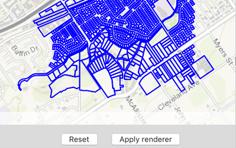

#Change feature layer renderer

This sample demonstrates how to override and reset a renderer of a feature layer.

##How to use the sample

Use the buttons in the bottom to apply or reset the renderer.

##How it works

`AGSFeatureLayer` has a property called `renderer` of type `AGSRenderer` you can set to override the renderer. And it provides a method called `resetRenderer` to reset to the original one.

