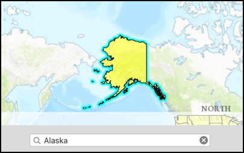

#Feature layer query

This sample demonstrates how to query a feature layer via feature table.

##How to use the sample

The sample provides a search bar, where you can input the name of a US State. When you hit enter the sample performs a query on the feature table and based on the result either highlights the state geometry or provides an error.

##How it works

When you hit the search button, the sample creates an `AGSQueryParameter` object and specifies the `whereClause` on it, using the text you provided. It then fires the query on the feature table using the `queryFeatures(with:completion:)` method. In the completion block it gets back an `AGSFeatureQueryResult`. Checking the enumerator, if it finds a feature then it highlights the geometry by using `select(_:)` method on feature layer.

