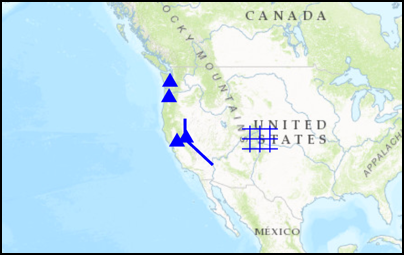

#Create geometries

This sample demonstrates simple ways to create different types of geometries.

##How it works

Geometries are created or changed using geometry builders (or builders, for short). To modify the geometry each geometry type has its own specific builder, such as the `AGSPolylineBuilder`, and `AGSPolygonBuilder`. All builders inherit directly from `AGSGeometryBuilder`. In the case of multi-part geometries such as `AGSPolylineBuilder` and `AGSPolygonBuilder` both inherit from the `AGSMultipartBuilder`. 

