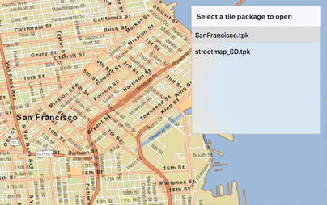

# ArcGIS tiled layer (tile cache)

This sample shows how to load an offline copy of a tiled map service so that that basemap tiled service is available when applications are offline

## How to use the sample

The sample opens with a local tiled layer already added as the basemap layer. The sample searches for tile packages in the bundle. The resulting packages are shown in the list by names. You can select a row to open the tile package in the map view.

## How it works

The sample instantiates an `AGSTileCache` object using either name or path of the tile package. It then creates an `AGSArcGISTiledLayer` object using that tile cache and assign it as a basemap to the map. It repeats these steps when the user selects a new tile package.

