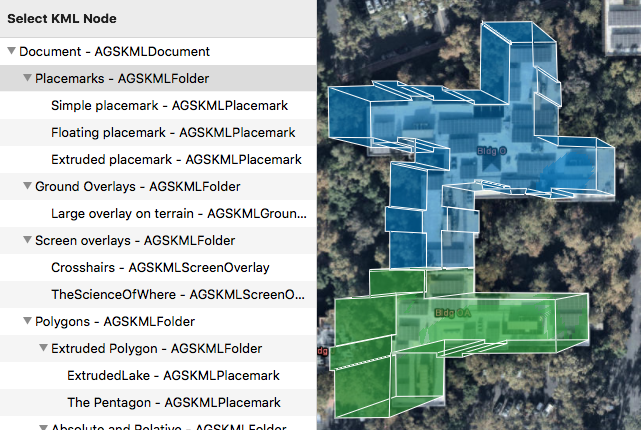

# List KML contents

List the contents of a KML file. KML files can contain a hierarchy of features, including network links to other KML content.

## How to use the sample

The contents of the KML file are shown in an outline view. Select a node to zoom to that node. Not all nodes have an extent that can be zoomed to (e.g. screen overlays).

## How it works

1. A local KML file is loaded and added to the scene as a layer.
2. All KML nodes are recursively set to be visible since some nodes may not be visible by default.
3. `AGSKMLDataset` is queried for the `NSOutlineViewDataSource`, starting with the `rootNodes` property and then recursively into their child nodes.
4. When you click on a cell in the outline view, its node's `extent` property is used to create a viewpoint and zoom to the node via the `setViewpoint` function of `AGSSceneView`.

## Relevant API

* `AGSKMLDataset`
* `AGSKMLNode`
* `AGSKMLLayer`

## About the data

This is an example KML file meant to demonstrate how Runtime supports several common features.

## Tags

KML, KMZ, OGC, Keyhole