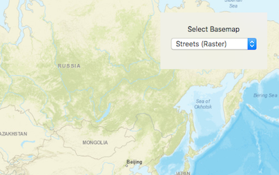

# Change basemap

This sample demonstrates how to change the basemap of a map.

## How to use the sample

The sample provides a segmented control that you can use to select and change a basemap in the map

## How it works

`AGSMap` has a `basemap` property of type `AGSBasemap`. On each selection, the app assigns the basemap of the specified type to `map.basemap`. `AGSBasemp` provides a set of factory methods for each of Esri's basemap.

