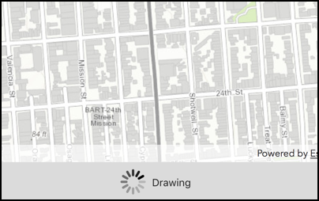

# Display drawing status

This sample displays the current drawing status of the map in the toolbar.

## How it works

`AGSMapView` has a property called `drawStatus` of type `AGSDrawStatus`. It could either be `inProgress` or `completed` based on if map is currently drawing or not. Using KVO, an observer is added for `drawStatus` and every time it changes the `NSProgressIndicator` is shown or hidden.

