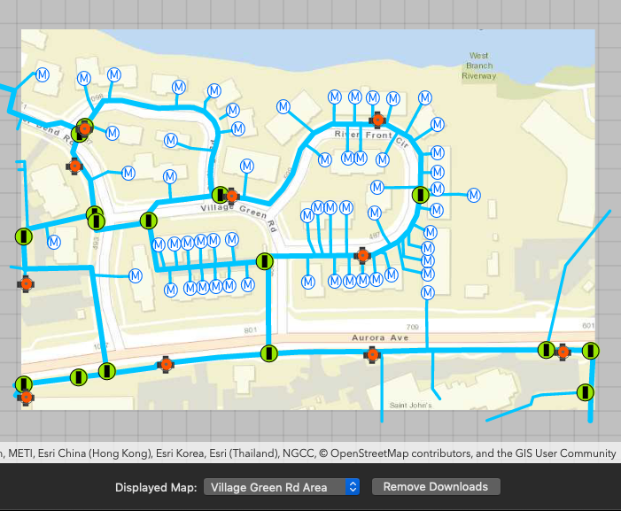

# Download Preplanned Map

This sample demonstrates how to download preplanned map areas from a webmap. In the preplanned offline workflow, the author of the online map defines map areas for offline use. When these areas are created, their offline packages are created and stored online for clients to download.

## How to use the sample

Select a preplanned map area from the popup button. A sheet appears showing the download progress. Once downloaded, the preplanned map is displayed in the map view. If a preplanned map is reselected later, the locally cached data is loaded immediately.

Click the "Remove Downloads" button to delete all the locally cached data.

## How it works

1. An `AGSPortalItem` and `AGSOfflineMapTask` are used to load the popup button with the available `AGSPreplannedMapArea` objects.
2. On selection, the data for the `AGSPreplannedMapArea` is downloaded using `downloadPreplannedOfflineMapJob(with preplannedMapArea: AGSPreplannedMapArea, downloadDirectory: URL) ` on the `AGSOfflineMapTask ` object.
3. On subsequent selections, the downloaded map is reloaded using `AGSMobileMapPackage(fileURL: URL)`.

## Relevant API

* `AGSOfflineMapTask`
* `AGSPreplannedMapArea`
* `AGSDownloadPreplannedOfflineMapJob`
* `AGSDownloadPreplannedOfflineMapResult`
* `AGSMobileMapPackage`