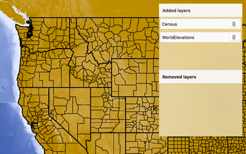

#Manage operational layers

This sample demonstrates how to add, remove or reorder operational layers in a map

##How to use the sample

The map in the sample app comes with two map image layers already added. The list is divided into two different sections. The first section has the layers that are currently part of the map and the second sections has the removed layers. In first section, you can click on the delete button to remove a layer or you can click hold and drag a row to reorder a layer. In the second section, you can simplify click on a removed layer to put it back. The layer gets added onto the top.

##How it works

`AGSMap` has a property called `operationalLayers` which is a list of `AGSLayer`. To add a layer the app uses the `(void) - addObject:` method on the list (`AGSList`). To remove a layer it uses `(void) - removeObjectAtIndex:` method and for re-ordering it uses a combination of those methods.

