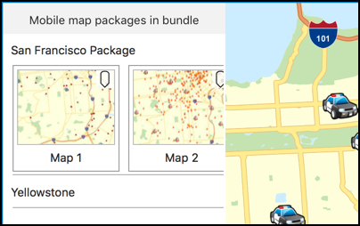

# Mobile map (search and route)

This sample demonstrates how to search and route using data in a map package.

## How to use the sample

The sample looks for map packages in the app bundle. All the resulting packages are shown in a table. You can click on a map package cell to see the maps inside the package. Each mobile map cell also indicates if the map has transportation network datasets or the package supports geocoding. You can click on a mobile map and it should open in map view. If the mobile map supports geocoding and/or routing you can click on the map for the results.

## How it works

The sample uses `initWithName:` initializer on `AGSMobileMapPackage` to instantiate a map package object using the name of the package that you select. It uses the `locatorTask` property on `AGSMobileMapPackage` to check if the package supports geocoding. It uses the `transportationNetworks` property on each mobile map to see if routing is supported. The logic for routing and geocoding is similar to the one used in the individual routing and geocoding samples.

