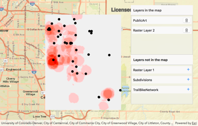

# Read a geopackage

This sample demonstrates how to add, remove or reorder operational layers in a map using a geopackage.

## How to use the sample

The map in the sample app starts out empty, with just a basemap. Two lists are shown over the map: A list of layers in the map (initially empty) and a list of layers _not_ in the map. The layers available are read from the geopackage. To add a layer to the map, simply click it in the `Layers not in the map` list. To remove a layer from the map, tap the trash can for the layer in the `Layers in the map` list and the layer will be returned to the `Layers not in the map` list. You can drag to reorder layers in the `Layers in the map` list.

## How it works

`AGSMap` has a property called `operationalLayers` which is a list of `AGSLayer`. To add a layer the app uses the `add()` method on the list (`AGSList`). To remove a layer it uses `remove()` method. To re-order layers, the app uses the `remove()` method and the `insert(at:)` method to re-add the layer at the appropriate index.
