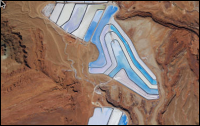

#Set initial map area

This sample displays a map at a specific viewpoint defined by an envelope.

##How it works

In this sample a viewpoint (`AGSViewpoint`) is constructed from an envelope (`AGSEnvelope`). Before the map is loaded the AGSMap's' initialViewpoint is set to this viewpoint. When you assign the map to the `AGSMapview` the map starts to load and the map zooms to this initial area.

