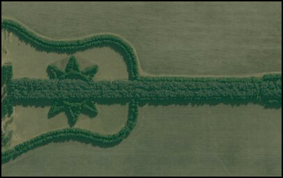

#Set initial map location

This sample creates a map that is centered on a latitude and longitude location and zoomed into a specific level of detail.

##How it works

The sample uses the map constructor to initialize a map with the imagery with labels basemap at an initial location to a specific level of detail.

