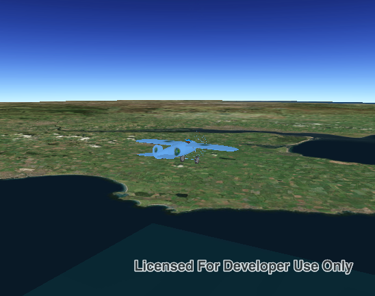

# Distance composite symbol

Demonstrates how to create a graphic using a distance composite scene symbol. Distance composite scene symbols can render different symbols depending on the distance between the camera and the graphic.

# How to use the sample

The symbol of the graphic will change while zooming in or out.

## How it works

To create and display a `AGSDistanceCompositeSceneSymbol`:

1. Create an `AGSGraphicsOverlay` and add it to the `AGSSceneView`.
1. Create symbols for each `AGSRange` of the composite symbol.
1. Create a distance composite scene symbol.
1. Create a range for each symbol using `AGSDistanceSymbolRange(symbol:minDistance:maxDistance:)`.
  * symbol: A symbol to be used within the given min/max range.
  * min/max distance: The minimum and maximum distance from the 'AGSCamera' for which the symbol will be shown.
1. Set the distance composite scene symbol ranges using `AGSDistanceCompositeSceneSymbol.ranges`.
1. Create an `AGSGraphic` with the symbol: `AGSGraphic(geometry:symbol:attributes:)`
1. Add the graphic to the graphics overlay.