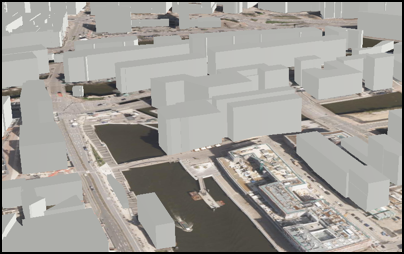

#Use scene layer

The sample shows how to use a scene layer in a scene.

##How it works

The sample initializes an `AGSArcGISSceneLayer` object using the `initWithURL` initializer. It then adds the scene layer to the scene’s `operationalLayers` using the `addObject` method.